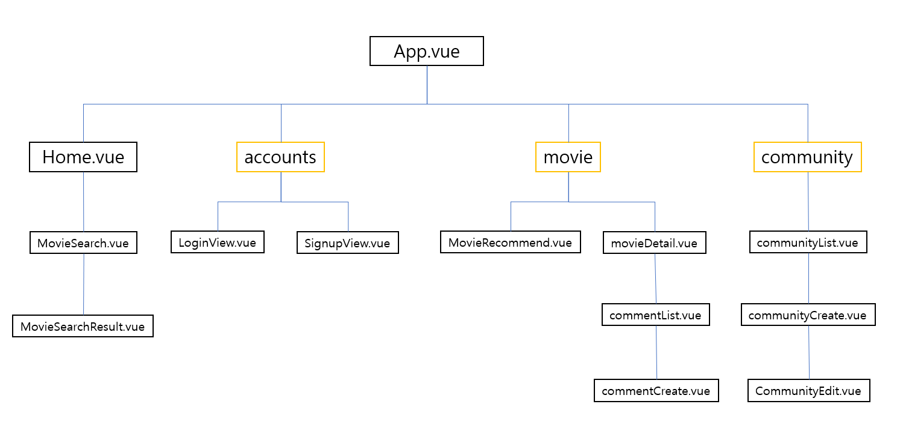
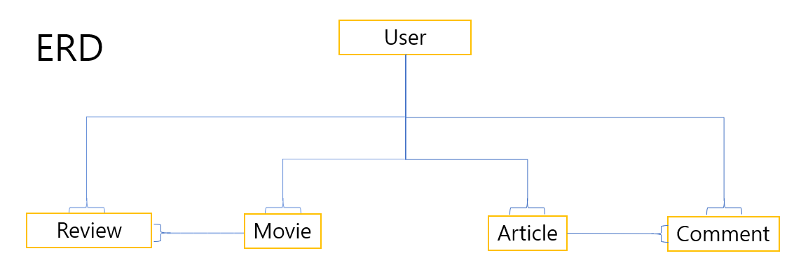

# FINAL-PJT

##### 프로젝트 기본 구조

1. 팀원 정보 및 업무 분담 내역
   - 팀원 정보 : 심동식(팀장), 김성웅
   - 업무 분담 내역
2. 목표 서비스 구현 및 실제 구현 정도
   - 목표 서비스
     - 필수 기능 구현은 기본
     - 영화 추천페이지에서의 다양한 아이디어
       1. 팔로우한 유저가  좋아요를 누른 영화기반 추천
       2. 내가 누른 좋아요의 영화 장르 우선 추천
       3. 내가 본 영화는 추천제외
       4. 평점 기반으로한 영화 추천
     - 별도의  관리자 페이지를 구현하여 영화 데이터 및 유저 관리
     - 커뮤니티에서 영화별로 글을 작성하여 내가 원하는 영화만 골라서 커뮤니티 보기 가능
   - 실제 구현 정도
     - 필수기능 구현
       - 관리자 admin페이지에서 영화 데이터, 유저 관리, 모든 게시물에 대한 CRUD 가능
       - fixtures폴더에 json 형식의 파일로 영화 데이터 저장
         - 네이버 API, TMDB API 를 활용한 데이터 수집
       - 추천 알고리즘
         - 평점을 기반으로 한 영화 추천 
         - 네이버 및 TMDB rating 별 영화 추천
         - 장르별 영화 추천
       - 영화 정보에 대한 대화를 나눌수 있도록 커뮤니티 페이지 제공
         - 로그인한 사용자만 커뮤니티 이용가능
         - 작성자 본인만 게시글 및 댓글 수정 가능
         - 게시글 및 댓글 생성/수정 시각 정보 제공
       - 기타
         - 최소한 5개 이상의 페이지 구성
         - alert를 이용하여 오류 메시지 제공
3. ERD

4. 느낀점

   처음에 프로젝트를 구상할때는 정말 많은 기능들을 넣고 싶었는데 프로젝트를 진행하면서 막히는 부분이 생기고 한번 막히면 하루종일 그 부분만 진행하다보니 속도가 너무 느려져서 원하는 기능들을 다 구현하지 못했습니다. 또한 짧은시간에 많은 것을 하려고 하다보니 마지막에서 지치기도 하였습니다. 다음부터 진행될 프로젝트에서는 일정을 먼저 확실하게 잡은 다음에 진행하는 것이 중요할것 같습니다.

   장고와 vue를 이용하여 진행 하면서 어려움을 느꼈던 부분은 장고 DB에 있는 데이터를 vue에서 필요한 부분만 받아와서 알고리즘을 짤때 힘들었습니다. 분명 데이터도 잘 들어오고 필터를 해서 필요한 부분만 따로 오브젝트에 모았는데 이 오브젝트를 사용하려고 할때 왜 안되는지 알수가 없는 그런 상황도 있었습니다.

   프로젝트를 하면서 많은것을 공부할 수 있었고 새로운 것들도 많이 볼수 있었습니다. 훌륭한 결과물은 아니지만 어느정도 만족하는 프로젝트이고, 장기적으로 시간을 두고 개인 프로젝트를 해보고 싶은 욕심도 생겼습니다.
